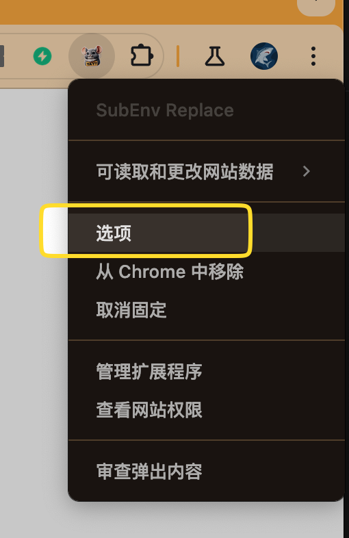

# Chrome Extension 开发入门指南

本教程中将引导了解并开发基于最新 Manifest V3（MV3）标准的Chrome插件。我们会一步步探索 Chrome 插件开发的核心部分，以及如何配合代码示例，理解每一块的具体运作方式。

## **基本概念** <a href="#id-ru-he-chuang-jian-yi-ge-chrome-cha-jian-ji-ben-gai-nian" id="id-ru-he-chuang-jian-yi-ge-chrome-cha-jian-ji-ben-gai-nian"></a>

通常，一个 Chrome 插件是一个完整的应用项目，它包含了一系列主要文件。其本身的开发语言为 javascript 。因此对于前端开发工程师来说，只要熟悉了整个结构以及 API，开发一个 Chrome 插件就没有那么困难了。

先来认识一下插件中的几个主要文件

### **manifest.json (必须)** <a href="#id-ru-he-chuang-jian-yi-ge-chrome-cha-jian-manifest.json-bi-xu" id="id-ru-he-chuang-jian-yi-ge-chrome-cha-jian-manifest.json-bi-xu"></a>

manifest.json 文件定义了插件的基本信息和行为。目前 manifest 的版本已经升级为 v3，并且将在 2024年6月禁止再使用 v2版本。

以下是一些关键字段的介绍和示例用法 ([read more](https://developer.chrome.com/docs/extensions/reference/manifest))：

| 字段名                                                                                                    | 示例                                                                                                           | 说明                                                                                                                |
| ------------------------------------------------------------------------------------------------------ | ------------------------------------------------------------------------------------------------------------ | ----------------------------------------------------------------------------------------------------------------- |
| <h4 id="id-ru-he-chuang-jian-yi-ge-chrome-cha-jian-manifestversion-bi-tian">manifest_version (必填)</h4> | "manifest\_version": 3,                                                                                      | 指定了插件使用的Manifest版本。对于Manifest V3，你应该设置为3。                                                                         |
| <h4 id="id-ru-he-chuang-jian-yi-ge-chrome-cha-jian-name-he-version-bi-tian">name 和 version (必填)</h4>   | <p>"name": "My New Extension",<br>"version": "1.0.0", </p>                                                   | <p><code>name</code> 字段定义了插件的名称，<br><code>version</code> 字段定义了插件的版本号。</p>                                         |
| <h4 id="id-ru-he-chuang-jian-yi-ge-chrome-cha-jian-action">action</h4>                                 | <p>"action": {</p><p>"default_popup": "popup.html",<br>"default_title": "My New Extension"</p><p>}, </p>     | `action` 字段定义了插件的用户界面，通常是浏览器工具栏上的一个按钮。                                                                            |
| <h4 id="id-ru-he-chuang-jian-yi-ge-chrome-cha-jian-optionspage">options_page</h4>                      | "options\_page": "options.html",                                                                             | 指定 options.html 文件的路径，以供扩展用作选项页面。                                                                                 |
| <h4 id="id-ru-he-chuang-jian-yi-ge-chrome-cha-jian-background">background</h4>                         | "background": {"service\_worker": "service-worker.js"}                                                       | <p><code>background</code> 字段定义了一个后台脚本，它会在插件安装后一直运行。<br>(在 v2 版本中，这个字段为 background.js，v3已经变更为 service_worker)</p> |
| <h4 id="id-ru-he-chuang-jian-yi-ge-chrome-cha-jian-permissions">permissions</h4>                       | "permissions": \[ "activeTab", "storage"],                                                                   | `permissions` 字段列出了插件所需的所有权限。                                                                                     |
| <h4 id="id-ru-he-chuang-jian-yi-ge-chrome-cha-jian-contentscripts">content_scripts</h4>                | <p>"content_scripts": [ { "js": ["content-script.js"],</p><p>"matches": [ "https://*.ctrip.com/*" ] } ],</p> | `content_scripts`字段定义了要在特定网页上运行的脚本路径。                                                                             |


### **Extension Service Worker：service-worker.js (backgournd.js)**

Service Worker 是扩展程序的核心事件处理脚本。Service Worker 在需要时加载，并在其进入休眠状态时取消加载。只要 Service Worker 在加载后还会主动接收事件，它就会运行。

因此在 service-worker.js 中，我们通常会定义一些监听事件。service-worker 作为一个chrome 后台脚本，它可以使用 Chrome 的一些 API， 但无法无法访问 DOM

Service worker 有几个生命周期 ([read more](https://developer.chrome.com/docs/extensions/develop/concepts/service-workers/lifecycle)):

| 生命周期 | 触发事件                                                                                       | 说明                                                                                      |
| ---- | ------------------------------------------------------------------------------------------ | --------------------------------------------------------------------------------------- |
| 安装   | <p>ServiceWorkerRegistration.install</p><p>addEventListener("install", (event) => {});</p> | 当用户从 Chrome 应用商店安装或更新 Service Worker，或者用户使用 `chrome://extensions` 页面加载或更新已解压的扩展程序时。     |
| 安装完成 | chrome.runtime.onInstalled                                                                 | 当该扩展程序（而不是 Service Worker）首次安装时、该扩展程序更新到新版本以及 Chrome 更新到新版本时，都会触发该事件。使用此事件来设置状态或一次性初始化。 |
| 激活   | <p>ServiceWorkerRegistration.active</p><p>addEventListener("activate", (event) => {});</p> | 在上一步安装完毕之后，会触发此项                                                                        |
| 启动   | chrome.runtime.onStartup                                                                   | 当用户个人资料启动时，会触发 `chrome.runtime.onStartup` 事件，但不会调用任何 Service Worker 事件。                 |

\
Service Worker 中可能用到的一些事件 ([read more](https://developer.chrome.com/docs/extensions/develop/concepts/service-workers/events))：

```javascript
// 当点击插件图标时，判断当前页面是否符合需要修改的页面
chrome.action.onClicked.addListener(async tab => {
    if (!tab.url) return
    const url = new URL(tab.url)
    const tabId = tab.id
    const isInMatchUrl = Match_URL.some(function (matchurl) {
        return url.origin.includes(matchurl)
    })
 
    if (isInMatchUrl) {
        // inject script in page first
    }
})
```

```javascript
// 当页面更新时
chrome.tabs.onUpdated.addListener((tabId, changeInfo, tab)=>{
    if(changeInfo.status === 'complete'){
        // your code here ...
    }
}
```


### **Content Scripts: content-script.js**

Content Scripts 可以读取和更改网页内容，但其本身被限制在沙盒中，无法更改和注入页面的 js。

我们可以通过 content script 来插入一些和页面元素融合的功能。也可以用于调整页面的样式布局，比如移除侧边栏的广告。

另外如果想让 content script 和其他脚本通信，可以使用 chrome.runtime.sendMessage 和 chrome.runtime.onMessage：

```javascript
// 在content script中发送消息
chrome.runtime.sendMessage({greeting: "hello"}, function(response) {
  console.log(response.farewell);
});
 
// 在 service worker 中监听消息
chrome.runtime.onMessage.addListener(
  function(request, sender, sendResponse) {
    if (request.greeting === "hello"){
      sendResponse({farewell: "goodbye"});
    }
  }
);
```


### Popup Page 和 Option Page

当用户点击插件图标时，展开的页面即是 Popup Page。而 Option Page 则对应插件的选项页面，一般用于插件的一些设置。同时也可以调用 chrome.storage 来进行存储和读取。

<div align="left">

<figure><figcaption></figcaption></figure>

</div>

Popup 和 Option 本身并不是必须的。这取决于插件本身是否需要。


## 开发实践

接下来我们以开发一个 “劫持并修改 fetch 请求功能” 的插件为例。\
插件实现的功能为，读取页面上的fetch请求，如果请求URL的 query 中有 subEnv，则可以允许用户调整 subEnv 的值。

劫持 fetch 在插件开发中可以有两种形式，

1.  通过 插件 API declarativeNetRequest 来劫持。

    优点：Chrome内核的 API 保证了可以劫持到所有请求\
    缺点：缺少灵活性且限制较多
2.  直接注入 js 来hook 页面上原有的 fetch 方法；

    优点：更灵活地处理方式，可以随意变更 request 和 response\
    缺点：注入的时机可能导致并不能覆盖所有请求


假设我们先以第一种方式来实现。首先需要修改 manifest 中的 permisssions

```json
"permissions": [ "declarativeNetRequest", "scripting", "storage"],
"declarative_net_request" : {
    "rule_resources" : []
},
"background": {
    "service_worker": "service-worker.js"
}
```

declarativeNetRequest 用于获取页面上的请求，并且需要声明对应的 rule 规则。([read more](https://developer.chrome.com/docs/extensions/reference/api/declarativeNetRequest))

在 manifest 中，我们可以指定 rule\_resources 为空，之后在插件让用户手动的选择需要被修改的 fetch URL，这样可以更灵活劫持需要处理的路径。

同时也需要 storage 权限来保存用户选择的 URL。

在 service-worker.js 中，可以通过监听 storage 变化来更新 rules

```javascript
// 监听 storage 变化
chrome.storage.onChanged.addListener((changes, namespace) => {
    const { subEvnItemList} = changes || {}
    const { newValue } = subEvnItemList || {}
    updateRulesForSubEvnItemList(newValue)
})

// 更新 rules
function updateRulesForSubEvnItemList(subEvnItemList){
    let newRules = []
    if(subEvnItemList?.length === 0) return
    // 对用户的选择进行处理以符合规则 Syntax
    subEvnItemList.map((item, index) => {
        const { enabled, subEvn, urlMatch } = item
        if(enabled && urlMatch){
            newRules.push({
                id: (+index + 1),
                priority: 1,
                action: {
                    type: 'redirect',
                    redirect: {
                        regexSubstitution: `\\1subEnv=${subEvn}&\\4`
                    }
                },
                condition: {
                    regexFilter: `(ctrip.com\/[^\t\n\f\r].*${urlMatch}[^\t\n\f\r].*)(subEnv=[^&]+($|&))(.*$)`
                }
            })
        } 
    })
    chrome.declarativeNetRequest.getDynamicRules(previousRules => {
        const previousRuleIds = previousRules.map(rule => rule.id);
        chrome.declarativeNetRequest.updateDynamicRules({
          removeRuleIds: previousRuleIds,
          addRules: newRules
        });
    });
}
```

declarativeNetRequest API 接受的规则可以通过正则表达式来命中需要的 URL。([read more](https://developer.chrome.com/docs/extensions/reference/api/declarativeNetRequest#type-RuleCondition))\
但由于限制，所支持的正则表达式并非完全态，贪婪方法并不适用。([RE2 Syntax](https://github.com/google/re2/wiki/Syntax))

declarativeNetRequest API 通过 updateDynamicRules 方法来动态修改 rules。([read more](https://developer.chrome.com/docs/extensions/reference/api/declarativeNetRequest#method-updateDynamicRules))


## 发布插件


